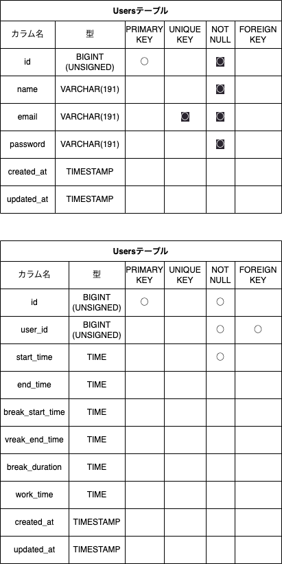
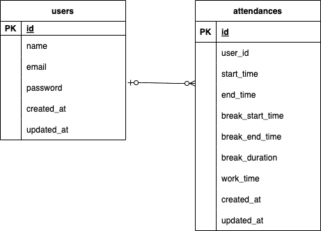

# Atte(アット)

ある企業の勤怠管理システム

## 作成した目的

人事評価のため

## 機能一覧

- 会員登録
- ログイン
- ログアウト
- 打刻：勤務開始（日を跨いだ時点で翌日の出勤操作に切り替える）
- 打刻：勤務終了（日を跨いだ時点で翌日の出勤操作に切り替える）
- 打刻：休憩開始（１日で何度も休憩が可能）
- 打刻：休憩終了（１日で何度も休憩が可能）
- 日付別勤怠情報取得
- ユーザー一覧
- ユーザー別勤怠情報取得
- メール認証（開発環境では Mailtrap を使用）

## 使用技術(実行環境)

- PHP8.3.0
- Laravel8.83.27
- MySQL8.0.26

## テーブル設計



## ER 図



## 環境構築

**Docker ビルド**

1. https://github.com/youhonami/Atte.git
2. DockerDesktop アプリを立ち上げる
3. `docker-compose up -d --build`

> _Mac の M1・M2 チップの PC の場合、`no matching manifest for linux/arm64/v8 in the manifest list entries`のメッセージが表示されビルドができないことがあります。
> エラーが発生する場合は、docker-compose.yml ファイルの「mysql」内に「platform」の項目を追加で記載してください_

```bash
mysql:
    platform: linux/x86_64(この文追加)
    image: mysql:8.0.26
    environment:
```

**Laravel 環境構築**

1. `docker-compose exec php bash`
2. `composer install`
3. 「.env.example」ファイルを 「.env」ファイルに命名を変更。または、新しく.env ファイルを作成
4. .env に以下の環境変数を追加

```
DB_CONNECTION=mysql
DB_HOST=mysql
DB_PORT=3306
DB_DATABASE=laravel_db
DB_USERNAME=laravel_user
DB_PASSWORD=laravel_pass
```

5. アプリケーションキーの作成

```bash
php artisan key:generate
```

6. マイグレーションの実行

```bash
php artisan migrate
```

7. シーディングの実行

```bash
php artisan db:seed
```

**Mailtrap 環境構築**

1. https://mailtrap.io/register/signup?ref=headerにアクセス
2. アカウントがなければ新規登録してログイン
3. Email Testing から Add Project でプロジェクトを作成
4. Credentials の内容を.env.dev に転記

MAIL_HOST=
MAIL_PORT=
MAIL_USERNAME=
MAIL_PASSWORD=

## URL

- 開発環境：http://localhost/login
- phpMyAdmin:：http://localhost:8080/
